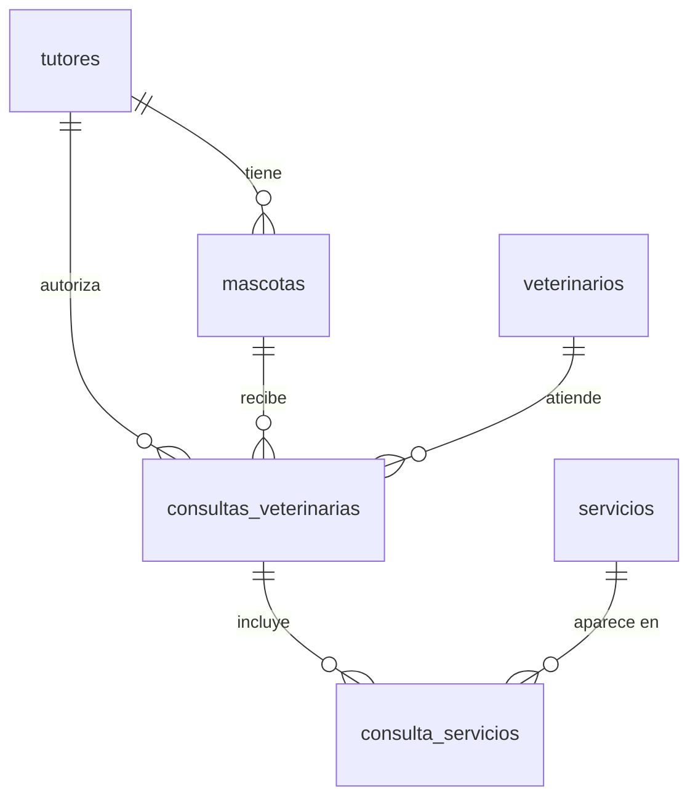

# Set 04 — Procedimientos almacenados y psql 🛠️

Tu veterinaria ya tiene un modelo sólido con 6 tablas, JOINs complejos y restricciones de
calidad. En este set das el salto a **lógica que vive en el servidor** y al control de la
base de datos desde la terminal, sin interfaz gráfica.

> 🎯 Pasar de "escribir SQL" a "programar y administrar la base de datos".

> **Requisito:** haber completado los Sets 01, 02 y 03.
>
> 🛟 **Empieza ejecutando [`setup.sql`](setup.sql)** en pgAdmin sobre `veterinariadb`:
> deja la base en el estado "Set 03 terminado" (6 tablas con datos completos).

## Ruta de aprendizaje

| # | Ejercicio | Aprendes | Tú haces |
|---|---|---|---|
| 1 | **[Conoce psql](paso1.md)** | `\l`, `\dt`, `\du`, `\d`, `\c`, `\q` | Conectarte, navegar y hacer consultas desde la terminal |
| 2 | **[Tu primera función](paso2.md)** | `CREATE FUNCTION`, `RETURNS TABLE`, `LANGUAGE sql` | Función de costo total y función de historial por tutor |
| 3 | **[Procedimiento almacenado](paso3.md)** | `CREATE PROCEDURE`, `LANGUAGE plpgsql`, `RETURNING INTO`, `RAISE NOTICE` | Procedimiento que registra una consulta en dos tablas a la vez |
| 4 | **[Usuarios y permisos](paso4.md)** | `CREATE USER`, `GRANT`, `REVOKE` | Usuario de solo lectura y usuario con permisos parciales |
| 5 | **[Backup y restauración](paso5.md)** | `pg_dump`, `psql < archivo`, `DROP DATABASE` | Hacer backup, modificar datos, borrar la base y restaurarla |

## El modelo con el que trabajas



En este set no agregas tablas: agregas **lógica, seguridad y resiliencia** encima del
modelo que ya existe.

## Función vs Procedimiento

```
FUNCTION  → devuelve un valor o tabla → se llama con SELECT
PROCEDURE → ejecuta acciones          → se llama con CALL
```

## Cómo trabajar

1. Ejecuta [`setup.sql`](setup.sql) en pgAdmin (solo la primera vez o para reiniciar).
2. Lee cada ejercicio y escribe el SQL en el Query Tool o en la terminal.
3. Para los ejercicios de terminal, abre **Terminal → New Terminal** en VS Code.
4. Intenta resolver tú primero; si te atascas, despliega **👀 Ver solución**.

## 📤 Entrega

Cada ejercicio se entrega con tu script `.sql` o `.txt` más una captura de pantalla.
Lee las instrucciones completas en **[Entrega de los ejercicios](ENTREGA.md)**.
